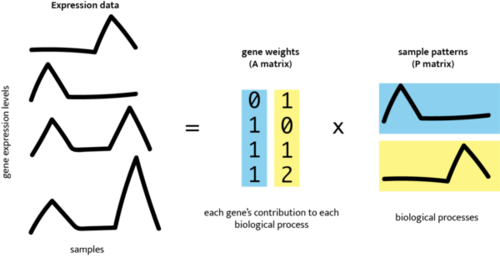

# **Context**
***

The Motivation section introduced the biological puzzle for this case study: a mixed population of blood immune cells is exposed to , and the resulting single-cell data contain both immune-cell identity and stimulation-response information. This Context section gives you the background needed to read those signals carefully.

The section has two jobs. First, it gives a short immunology primer: what systemic lupus erythematosus is, why interferon biology is relevant, why PBMCs are useful but mixed, and what the Kang et al. source study measured. Second, it introduces the modeling frame: why clustering alone is not enough for this question, how latent patterns and non-negative matrix factorization work, and how CoGAPS turns a genes-by-cells matrix into evidence you can interpret later.

By the end of this section, you should be ready to enter Data Import with a map in mind. You will know what biological signals the literature suggests you might see, what the source study already established, and why later sections focus on pattern activity, gene weights, directionality, rank choice, and diagnostics.

## What is systemic lupus erythematosus?

, or SLE, is a systemic . In an autoimmune disease, the immune system can respond to the body's own cells or molecules. In SLE, that immune activity can affect several organ systems, and symptoms may include fatigue, fever, joint pain or swelling, skin rashes, mouth sores, blood abnormalities, kidney involvement, neurologic symptoms, or inflammation around the heart or lungs [@niams_lupus_overview].

The word **systemic** matters. SLE is not limited to one tissue or one immune-cell type. A person with SLE can have immune signals in blood that relate to inflammation elsewhere in the body. That is one reason blood immune-cell data are useful for teaching this case study: PBMCs are accessible, contain multiple immune-cell populations, and can carry molecular evidence of immune activation.

SLE is also heterogeneous. Two people with the same diagnosis may have different symptoms, affected tissues, autoantibodies, treatment histories, and immune-cell composition. That heterogeneity is part of what makes lupus difficult to study. It also explains why this case study will avoid overclaiming. We are not trying to diagnose SLE, predict disease activity, or prove a clinical mechanism. We are using a lupus PBMC perturbation dataset to learn how an interpretable interferon-associated signal can be separated from immune-cell identity in single-cell RNA-seq data.

## Interferon-beta and its role in lupus

 are cytokines: signaling proteins that help immune cells coordinate responses to infection, tissue damage, and other danger signals.  include IFN-alpha, IFN-beta, IFN-omega, IFN-epsilon, and IFN-kappa [@chyuan2019interferons]. This case study focuses on IFN-beta because IFN-beta is the controlled stimulation used in the source dataset.

A useful way to understand interferon signaling is to follow the signal from outside the cell to the genome. Type I interferons bind the type I interferon receptor, also called . That receptor activates the  pathway, including JAK1, TYK2, STAT1, STAT2, and IRF9. These proteins help turn on many , often abbreviated ISGs [@chyuan2019interferons]. In plain language, interferon signaling can leave a recognizable gene-expression footprint.

In lupus, this footprint is often called an . Several lupus studies have reported interferon-associated gene-expression signatures in blood, PBMCs, purified immune-cell populations, and affected tissues [@chyuan2019interferons; @catalina2019interferonSLE]. Catalina and colleagues found that interferon signatures in SLE datasets can include prominent IFNB1-like signatures and can be strongly related to monocyte-associated transcripts [@catalina2019interferonSLE]. That observation is important for this case study because it points to a recurring interpretive issue: an interferon signal may be broad, but it may also vary by cell type.

The immune-cell players are worth naming.  are known for producing large amounts of type I interferon in response to nucleic-acid sensing. Monocytes and macrophages can participate in inflammatory responses and antigen presentation. Dendritic cells can help connect innate sensing to T-cell and B-cell responses. B cells can contribute to antibody responses, including autoantibody-related processes. T cells help coordinate or carry out adaptive immune responses. Natural killer cells contribute to cytotoxic responses. Neutrophils can release neutrophil extracellular traps, which may provide nucleic-acid material that stimulates interferon pathways in lupus [@chyuan2019interferons].

The main idea is not that every cell type does the same thing. The main idea is that interferon biology connects several immune-cell populations. That makes it plausible that a single-cell analysis could contain both a shared interferon-response signal and cell-type-linked structure at the same time.

## PBMCs as a mixed immune-cell system

, or PBMCs, are blood immune cells with round nuclei. They include lymphocytes, such as T cells, B cells, and natural killer cells, as well as monocytes and some dendritic cells. PBMCs do not include every immune cell in blood; for example, mature neutrophils are usually not part of the PBMC fraction. Still, PBMCs are widely used because they are accessible and contain many immune populations relevant to systemic immune activity.

For this case study, PBMCs are useful for the same reason they are challenging. A PBMC sample is not one cell type. It is a mixture. A stimulated monocyte can still have monocyte-like expression. A stimulated B cell can still have B-cell-like expression. A stimulated natural killer cell can still have cytotoxic-cell features. At the same time, all of those cells may share some response to IFN-beta.

This creates a layered interpretation problem. Each cell can carry:

1. an immune-cell identity signal,
1. a stimulation-associated signal,
1. donor-specific variation,
1. technical variation, and
1. noise from sparse single-cell measurement.

No single metadata label captures all of these layers. A cell-type label tells you what a cell most resembles, but not everything that cell is doing. A condition label tells you whether a cell came from control or stimulated culture, but not which genes drove its response. A latent-variable approach is useful because it can represent cells as mixtures of several signals rather than forcing each cell into one explanatory box.

## Summary of the Kang et al. study

The source study for this case study is Kang et al. 2018, which introduced demuxlet and used multiplexed droplet single-cell RNA-seq to study PBMC responses to IFN-beta [@kang2018multiplexed]. The original paper's main methodological contribution was demuxlet: a computational approach that uses natural genetic variation to assign each droplet to a donor and detect droplets that likely contain cells from more than one person.

The IFN-beta part of that study used PBMCs from eight lupus patients. For each donor, the researchers split PBMCs into two matched portions, or . One aliquot was left untreated as a control. The other was stimulated with recombinant IFN-beta for six hours. After stimulation, cells were pooled by condition and profiled using droplet single-cell RNA-seq [@kang2018multiplexed].

That design has two features that matter for the rest of the case study.

First, it is a . The experiment deliberately changes one condition, IFN-beta exposure, so that the transcriptional response can be measured. This gives the analysis a clear contrast: control versus IFN-beta stimulated cells.

Second, it is a . Control and stimulated cells come from the same donors. That matters because immune profiles can differ substantially across people. A paired design lets the source study compare stimulation responses while keeping donor background more visible.

Kang et al. also used  and  detection. In droplet single-cell RNA-seq, a droplet ideally contains RNA from one cell. A doublet occurs when material from two cells is captured together and treated as one observation. Demuxlet helped assign cells back to donors and remove likely doublets, improving confidence that later summaries reflected singlet cells rather than mixed droplets [@kang2018multiplexed].

The exact files and teaching data objects used in this case study are described in the next section, **What are the data?** Here, the important source-study point is conceptual: the dataset was designed to compare matched control and IFN-beta-stimulated PBMCs from lupus donors while retaining single-cell and cell-type information.

## Source-study findings to carry forward

Kang et al. did not use CoGAPS. The original paper used the dataset to demonstrate multiplexed droplet single-cell RNA-seq, demuxlet, cell-type-specific response analysis, and genetic analyses. This case study reuses the source dataset for a different teaching goal: learning how CoGAPS can recover and interpret latent transcriptional patterns.

Several source-study findings should guide your expectations before you see the CoGAPS results:

- IFN-beta stimulation produced broad transcriptional changes across PBMCs.
- The source study identified thousands of genes with differential expression in at least one cell type after IFN-beta stimulation [@kang2018multiplexed].
- The IFN-beta response included antiviral, chemokine, and lupus-related pathway signals.
- IFN-beta stimulation did not erase cell identity. The original analysis still recovered major immune-cell groups after stimulation.
- Cell-type composition and donor-to-donor variation both mattered, which is why the case study keeps cell type and donor metadata visible.

These findings are expectations, not answers. They tell you what kinds of signals would be biologically plausible. Later sections ask whether the CoGAPS patterns support those expectations in the teaching data.

## Interferon genes learners should recognize

You do not need to memorize a long list of interferon genes. You do need enough vocabulary to recognize why a later top-gene list might support an interferon-associated interpretation.

Several gene families often appear in interferon-response analyses:

- **ISG genes**, such as `ISG15` and `ISG20`, are named as interferon-stimulated genes and often appear in interferon-response signatures.
- **IFIT and IFITM genes**, such as `IFIT1`, `IFIT2`, `IFIT3`, and `IFITM` family members, are commonly associated with antiviral interferon responses.
- **IFI genes**, such as `IFI6`, are part of a broad set of interferon-inducible genes.
- **MX and OAS genes**, such as `MX1`, `OAS1`, and `OASL`, are classic antiviral-response genes that often appear downstream of interferon signaling.
- **IRF and STAT-related genes**, such as `IRF7` and `STAT1`, connect to transcriptional regulation and interferon pathway signaling.
- **Nucleic-acid sensing genes**, such as `DDX58` and `IFIH1`, relate to sensing viral or self nucleic acids and can connect upstream danger sensing to interferon responses.
- **Chemokine and immune-regulatory genes**, such as `CXCL10`, `TNFSF10`, and `SOCS1`, can reflect downstream immune communication or regulation.

These gene names are anchors for interpretation, not shortcuts. A top-gene list that includes several canonical interferon-related genes is consistent with an interferon-associated pattern. But you still need to ask where the pattern is active, whether it tracks stimulation, and whether the genes are higher or lower in stimulated cells.

This last point is important. CoGAPS gene weights identify genes that help define a pattern. They do not, by themselves, tell you whether a gene is upregulated or downregulated. Later, you will pair pattern weights with condition-based directionality checks.

## From cell clusters to latent patterns

Clustering is often one of the first useful tools in single-cell RNA-seq analysis. A clustering workflow groups cells with similar expression profiles, and those groups can help analysts assign cell-type labels. Reviews of single-cell clustering emphasize that clustering is central to identifying putative cell types, but also that interpretation is challenging because single-cell data are high-dimensional, sparse, and sensitive to preprocessing choices [@kiselev2019singleCellClustering].

For this case study, clustering is helpful but not sufficient. Clustering asks which cells are similar overall. The research questions ask something more layered: which transcriptional signals are present, which signals are shared across immune-cell types, and which signals are most associated with IFN-beta stimulation.

Kotliar and colleagues describe this as a distinction between cell-type identity programs and cellular activity programs [@kotliar2019identityActivity]. An identity program reflects what a cell is, such as a T cell, B cell, monocyte, or dendritic cell. An activity program reflects what a cell is doing, such as responding to stimulation, cycling, producing cytokines, or activating an antiviral pathway.

The difficult part is that a single cell can express both kinds of programs. A monocyte can have monocyte identity genes and interferon-response genes. A T cell can have T-cell markers and stimulation-response genes. A B cell can retain B-cell identity while also responding to IFN-beta. That is why a one-cell, one-cluster view can be too restrictive for this case study.

A  is an inferred signal learned from the expression matrix. It is not a metadata column recorded by the experiment. A useful latent pattern might be identity-like, stimulation-associated, donor-linked, technical, or mixed. The analysis task is not simply to name every pattern. The task is to evaluate each pattern using evidence.

:::{.think_question}
::::{.think_question_header}
Stop and think
::::
::::{.inner_block}
Why might a stimulated monocyte be hard to interpret with only one label?

<details><summary>Answer</summary>
A stimulated monocyte carries at least two interpretable signals: it still has monocyte-like expression, and it may also activate interferon-response genes. A single label can name the cell identity, but it does not describe every transcriptional program active in that cell.
</details>
::::
:::

## NMF: the mathematical shape of the problem

Single-cell RNA-seq data can be organized as a matrix. In this case study, the modeling input is a genes-by-cells matrix. Each row represents a gene, each column represents a cell, and each entry is a non-negative expression value.

, or NMF, asks whether a large non-negative matrix can be approximated as the product of two smaller non-negative matrices. At the intuition level:

```text
observed expression matrix ~= gene weights x cell activities
```

In a compact mathematical form:

$$
D \approx A P
$$

Here:

| Object | What it represents | How to read it |
|---|---|---|
| `D` | the observed expression matrix | genes by cells |
| `A` | the gene-by-pattern matrix | which genes contribute to each pattern |
| `P` | the pattern-by-cell matrix | which cells use each pattern strongly |
| `K` | the number of patterns requested | the model resolution |

For one gene and one cell, the model approximates expression by adding up contributions from all `K` patterns:

$$
D_{g,c} \approx \sum_{k=1}^{K} A_{g,k} P_{k,c}
$$

In plain language, a cell's expression profile is represented as a mixture of learned patterns. The non-negative constraint matters because patterns add together rather than cancel each other out. That additive structure fits the PBMC problem: a cell can be monocyte-like and interferon-response-like at the same time.

NMF is not magic. It does not know biology by itself. It produces matrices that must be interpreted using genes, cell metadata, experimental design, diagnostics, and prior biological knowledge.

## How CoGAPS extends vanilla NMF

 is the NMF-family method used in this case study. The name stands for Coordinated Gene Activity in Pattern Sets. CoGAPS was introduced as an R/C++ package for identifying patterns and biological process activity in transcriptomic data [@fertig2010cogaps]. Later single-cell CoGAPS work extended this latent-pattern framework to sparse single-cell RNA-seq data [@steinobrien2019transferLearning]. The official [CoGAPS User Guide](https://fertiglab.github.io/CoGAPSGuide/){target="_blank"} introduces the method and software workflows for R and Python users.

:::: {.columns}
::: {.column width="22%"}
{fig-alt="CoGAPS logo showing a stylized bird beside the letters A and P, the two CoGAPS output matrices." width="130"}
:::

::: {.column width="78%"}
{fig-alt="Schematic from the CoGAPS User Guide showing an input matrix represented by pattern matrices and corresponding pattern profiles." width="100%"}
:::
::::

*Image credit: CoGAPS logo and schematic from the [Fertig Lab CoGAPS User Guide](https://fertiglab.github.io/CoGAPSGuide/){target="_blank"}.*

The schematic above shows the same basic matrix idea introduced in the NMF section: a large gene-expression matrix is represented by a smaller set of learned patterns. CoGAPS keeps that additive, non-negative structure, but fits the model using a Bayesian, sampling-based approach. Instead of treating one numerical factorization as the whole answer, CoGAPS samples plausible factorizations and summarizes them. This gives the method a natural connection to diagnostics, uncertainty, and stability checks.

You do not need to understand every sampling detail to use the case study. The learner-facing interpretation rests on four ideas:

1. **Patterns are overlapping.** A cell can use more than one pattern.
1. **Pattern numbers are run-specific.** A biological signal should be identified by evidence, not by assuming one pattern label is universal.
1. **Gene weights are not directionality.** A high-weight gene helps define a pattern, but a separate condition comparison is needed to determine whether the gene is higher or lower after stimulation.
1. **Diagnostics matter.** A biologically tempting pattern still needs evidence that the model ran sensibly and that the interpretation is stable enough to use.

The case study uses the R/Bioconductor CoGAPS workflow as the primary implementation. Python/PyCoGAPS-compatible outputs are provided as a secondary implementation path in later tabbed examples. That implementation detail matters for reproducibility, but the interpretation frame is the same: connect pattern activity, gene weights, source-study design, and biological expectations.

## What choosing `K` means

The rank, written as `K`, is the number of latent patterns CoGAPS is asked to learn. Choosing `K` is a model-resolution decision.

If `K` is too small, distinct biological signals can be compressed together. For example, one pattern might blend an interferon response with cell-type identity. If `K` is too large, a signal can fragment across several patterns, making the model harder to interpret and less stable. Neither extreme is automatically better.

This is why the case study does not treat `K` as a purely technical setting. The useful value of `K` depends on the analysis goal. Here, the goal is not only to find a strong interferon-response signal. The goal is to find a model that also preserves enough non-interferon structure to respect the mixed PBMC system.

The value of `K` used for the main analysis is introduced in Data Import after you inspect model-selection evidence. Context gives you the idea; the next sections provide the evidence.

## Why run a rank sweep?

A rank sweep means fitting or evaluating CoGAPS models across several candidate values of `K`. The purpose is to ask how model interpretation changes as the requested number of patterns changes.

For self-guided learners, the important point is that the sweep is precomputed. You will not need to rerun the full sweep during the main learner path. Instead, you will inspect saved summaries that compare candidate ranks using evidence such as:

- whether the interferon-related signal is recovered consistently,
- whether top genes are stable across seeds,
- whether non-interferon structure is preserved,
- whether patterns appear redundant or fragmented,
- how runtime changes as `K` increases, and
- whether the eventual model is interpretable for the biological question.

This is a good example of a broader modeling principle: model choice should be tied to the scientific question. A rank that maximizes one metric may not be the best teaching or biological model if it collapses other important structure.

## How pattern evidence will be interpreted later

Later sections will use CoGAPS outputs, but the interpretation logic starts here. A pattern becomes biologically meaningful only after several kinds of evidence agree.

You will ask:

1. **Where is the pattern active?** Cell activities show which cells use the pattern strongly.
1. **Does activity track the experimental condition?** Stimulation-associated activity should differ between control and IFN-beta-stimulated cells.
1. **Which genes define the pattern?** Gene weights identify genes that contribute strongly to the pattern.
1. **Do the top genes fit known biology?** Interferon-associated genes provide literature-guided expectations.
1. **Which direction do the genes move?** Directionality checks ask whether genes are higher or lower after stimulation.
1. **Does the pattern respect cell identity?** Cell-type summaries help distinguish broad stimulation activity from cell-type-linked structure.
1. **Did the model run sensibly?** Diagnostics help evaluate convergence, stability, and fit.

These evidence types are intentionally separate. A pattern can have plausible genes but weak condition association. A pattern can correlate with stimulation but include genes that require careful directionality checks. A pattern can be strong in one cell type but weaker in another. The case study will teach you to combine these pieces rather than rely on one plot or one statistic.

## Interpretive boundaries before analysis

The Context section should give you expectations, not conclusions. The source data come from lupus donors, but the main analysis studies an in vitro IFN-beta stimulation response. The case study does not test a lupus therapy, predict patient outcomes, or prove a disease mechanism. Those limitations are discussed more fully later.

For now, carry forward a narrower and more useful question: can a latent-pattern model help separate a broad interferon-response signal from immune-cell identity in a mixed PBMC single-cell dataset?

:::{.definition_box}
::::{.definition_box_header}
Core distinctions to carry forward
::::
::::{.inner_block}

- **PBMC identity versus stimulation response:** A cell can retain immune-cell identity while also responding to IFN-beta.
- **Cell cluster versus latent pattern:** A cluster groups similar cells; a latent pattern can be shared across cells in different groups.
- **Gene weight versus expression direction:** A high-weight gene helps define a pattern; directionality asks whether that gene rises or falls after stimulation.
- **Rank `K` versus pattern label:** `K` controls how many patterns the model learns; pattern labels are names assigned within one run.
- **Literature expectation versus analysis result:** Interferon biology tells you what to look for; the CoGAPS analysis tests whether the data support that interpretation.
::::
:::

The next section turns this background into concrete files. You will see which processed data objects are included in the case study, which saved CoGAPS artifacts support the main learner path, and which larger files are optional for full reproduction. With the biological and modeling vocabulary in place, those files should read less like a list of artifacts and more like the evidence chain you will use to answer the main questions.

***
