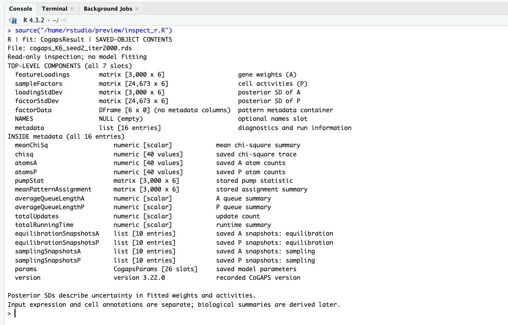
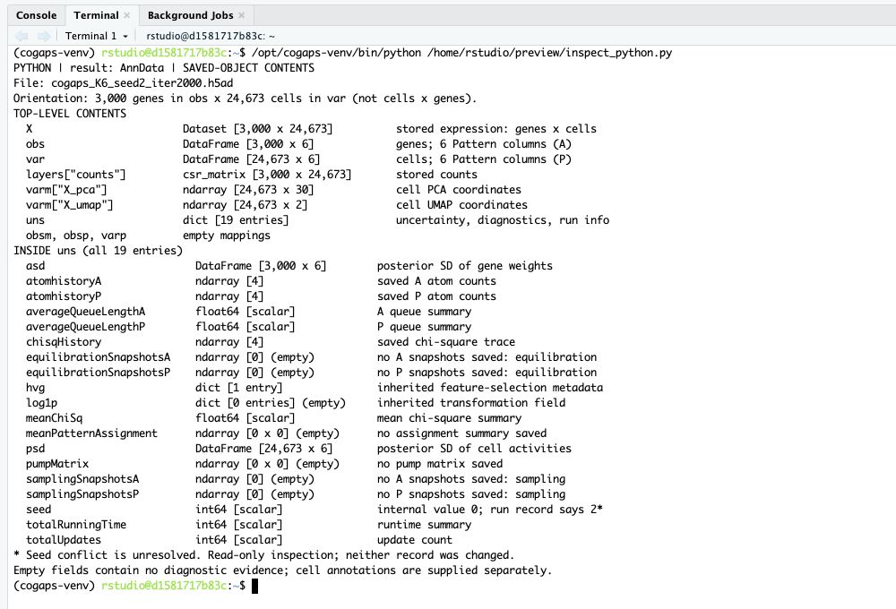

# **Data Exploration**
***

Now that you have imported the model-selection evidence, the prepared PBMC data, and the selected-model files, pause before interpreting any CoGAPS pattern biologically. Data exploration asks a simpler question: what information is actually in front of us?

This section checks four things:

1. the size and structure of the prepared single-cell data,
2. whether the paired control and IFN-beta conditions are represented across donors,
3. which PBMC cell types dominate the dataset, and
4. what the saved CoGAPS output tables contain before we name any pattern.

These checks are not the final analysis. They are the evidence map you need before deciding whether a later pattern is stimulation-associated, cell-type-linked, donor-influenced, or some combination of those signals.

## Check The Prepared Single-Cell Data

The prepared data are stored in a single-cell data container. In R, that container is a  called `sce_cells`. In Python, the same data are stored in an  object called `adata_cells`.

The two languages organize the same information with different names:

| Information | R `SingleCellExperiment` | Python `AnnData` | What it means |
|---|---|---|---|
| Cells | columns and `colData()` | rows and `.obs` | Each profiled cell has metadata such as condition, cell type, and donor. |
| Genes | rows and `rowData()` | columns and `.var` | Each retained gene has gene-level annotations. |
| Expression matrix | assay, such as `"X"` | `.X` or named layers | Gene-expression values used for downstream summaries. |
| Two-dimensional coordinates | `reducedDims()` or metadata columns | `.obsm` or metadata columns | Coordinates used for UMAP plots. |

The next chunk turns those containers into a compact structure check. Notice that the R and Python shape reports are reversed. That is normal: R reports genes by cells, while Python reports cells by genes.

::: {.panel-tabset}

### R

```{r}
exploration_structure_r <- tibble::tibble(
  check = c(
    "Genes retained",
    "Cells retained",
    "Cell metadata columns",
    "Gene metadata columns",
    "Expression assays",
    "Reduced dimensions"
  ),
  value = c(
    format(nrow(sce_cells), big.mark = ","),
    format(ncol(sce_cells), big.mark = ","),
    ncol(colData(sce_cells)),
    ncol(rowData(sce_cells)),
    paste(assayNames(sce_cells), collapse = ", "),
    paste(reducedDimNames(sce_cells), collapse = ", ")
  ),
  why_it_matters = c(
    "Defines the gene space used for the teaching analysis.",
    "Defines the cells available for condition and cell-type summaries.",
    "Stores condition, donor, and cell-type labels.",
    "Stores gene-level annotations.",
    "Stores expression values that later code can summarize.",
    "Stores low-dimensional coordinates for visual exploration."
  )
)

knitr::kable(
  exploration_structure_r,
  col.names = c("Check", "Value", "Why it matters")
)
```

### Python

```{python}
#| results: asis
exploration_structure = pd.DataFrame(
    {
        "Check": [
            "Cells retained",
            "Genes retained",
            "Cell metadata columns",
            "Gene metadata columns",
            "Expression layers",
            "Embeddings",
        ],
        "Value": [
            f"{adata_cells.n_obs:,}",
            f"{adata_cells.n_vars:,}",
            len(adata_cells.obs.columns),
            len(adata_cells.var.columns),
            ", ".join(adata_cells.layers.keys()),
            ", ".join(adata_cells.obsm.keys()),
        ],
        "Why it matters": [
            "Defines the cells available for condition and cell-type summaries.",
            "Defines the gene space used for the teaching analysis.",
            "Stores condition, donor, and cell-type labels.",
            "Stores gene-level annotations.",
            "Stores expression values that later code can summarize.",
            "Stores low-dimensional coordinates for visual exploration.",
        ],
    }
)

print(render_table(exploration_structure))
```

:::

This confirms the working scale of the case study: 24,673 cells and 3,000 highly variable genes (HVGs). The 3,000-gene subset is a practical choice for this teaching analysis, not a CoGAPS requirement; it can exclude biologically relevant genes. You will revisit how and why that prepared matrix was created in **Data Wrangling**. For exploration, the important point is that the prepared cell-level metadata and UMAP coordinates are present.

## Inspect The Cell Metadata

Single-cell RNA-seq data are useful because each cell keeps its own expression profile. But the expression profile is only interpretable when it stays connected to the right . Here, the three most important metadata columns are:

- `condition`, which records whether the cell came from the control or IFN-beta-stimulated aliquot;
- `cell_type`, which records the annotated PBMC identity; and
- `replicate`, which records which individual the sample cane from

The code below creates a small preview table. In R, `colData(sce_cells)` retrieves cell metadata, and `rownames_to_column()` turns the cell names into an explicit `cell_barcode` column. In Python, `.obs` stores the same cell metadata, and `reset_index()` turns the AnnData index into a visible cell-barcode column.

::: {.panel-tabset}

### R

```{r}
cell_metadata_r <- as.data.frame(colData(sce_cells)) |>
  tibble::rownames_to_column("cell_barcode")

cell_metadata_preview_r <- cell_metadata_r |>
  dplyr::select(cell_barcode, condition, cell_type, replicate) |>
  dplyr::slice_head(n = 6)

knitr::kable(cell_metadata_preview_r)
```

### Python

```{python}
#| results: asis
cell_metadata = adata_cells.obs.reset_index(names="cell_barcode").copy()

metadata_preview = (
    cell_metadata.loc[:, ["cell_barcode", "condition", "cell_type", "replicate"]]
    .head(6)
)

print(render_table(metadata_preview))
```

:::

Each row is one profiled cell. In single-cell RNA-seq, a  is the identifier assigned to a captured cell or droplet during sequencing and processing. It is not a gene and it is not a cell-type label. Instead, it acts like a lookup key: it keeps one cell's expression values connected to that cell's condition, donor, annotated immune-cell identity, and UMAP coordinates. In this prepared dataset, the barcode is stored as the row name or index, so the code makes it visible as a `cell_barcode` column before previewing the metadata. Later, CoGAPS activity scores will be joined to these same cell barcodes so you can ask whether a pattern follows stimulation, cell identity, or both.

## Check The Paired Perturbation Design

The source study used a : PBMCs from the same donor were split into control and IFN-beta-stimulated aliquots. Before interpreting stimulation-associated patterns, check whether both conditions are represented and whether each donor contributes cells to both conditions.

The first summary counts cells by condition. In R, `dplyr::count()` counts the rows in each condition group, and `mutate()` adds a percentage column. In Python, `value_counts()` performs the same count, and then a new percentage column is calculated from the total.

::: {.panel-tabset}

### R

```{r}
condition_counts_r <- cell_metadata_r |>
  dplyr::count(condition, name = "n_cells") |>
  dplyr::mutate(
    share_of_cells = sprintf("%.1f%%", 100 * n_cells / sum(n_cells))
  ) |>
  dplyr::arrange(dplyr::desc(n_cells))

knitr::kable(
  condition_counts_r,
  col.names = c("Condition", "Cells", "Share of cells")
)
```

### Python

```{python}
#| results: asis
condition_counts = (
    cell_metadata["condition"]
    .value_counts()
    .rename_axis("condition")
    .reset_index(name="n_cells")
)
condition_counts["share_of_cells"] = (
    100 * condition_counts["n_cells"] / condition_counts["n_cells"].sum()
).round(1).astype(str) + "%"

print(render_table(
    condition_counts.rename(
        columns={
            "condition": "Condition",
            "n_cells": "Cells",
            "share_of_cells": "Share of cells",
        }
    )
))
```

:::

The control and stimulated conditions are nearly balanced. That does not prove the later model will be easy to interpret, but it removes one obvious concern: the stimulation comparison is not dominated by a large difference in total cell counts.

Next, check donor coverage. This chunk makes a donor-by-condition table. In R, `count()` first counts cells by `replicate` and `condition`, then `tidyr::pivot_wider()` turns condition values into separate columns. In Python, `pd.crosstab()` builds the same wide table directly.

::: {.panel-tabset}

### R

```{r}
replicate_condition_counts_r <- cell_metadata_r |>
  dplyr::count(replicate, condition, name = "n_cells") |>
  tidyr::pivot_wider(
    names_from = condition,
    values_from = n_cells,
    values_fill = 0
  ) |>
  dplyr::mutate(total_cells = ctrl + stim) |>
  dplyr::arrange(dplyr::desc(total_cells))

knitr::kable(
  replicate_condition_counts_r,
  col.names = c("Replicate", "Control cells", "Stimulated cells", "Total cells")
)
```

### Python

```{python}
#| results: asis
replicate_condition_counts = pd.crosstab(
    cell_metadata["replicate"],
    cell_metadata["condition"],
)
replicate_condition_counts["total_cells"] = replicate_condition_counts.sum(axis=1)
replicate_condition_counts = (
    replicate_condition_counts
    .sort_values("total_cells", ascending=False)
    .reset_index()
)

print(render_table(
    replicate_condition_counts.rename(
        columns={
            "replicate": "Replicate",
            "ctrl": "Control cells",
            "stim": "Stimulated cells",
            "total_cells": "Total cells",
        }
    )
))
```

:::

Every donor has cells in both conditions. The counts are not identical, which is expected in single-cell data, but the paired structure is visible. This matters because a later stimulation-associated pattern should be interpreted against donor and cell-type context, not as if all cells were unrelated measurements.

:::{.think_question}
::::{.think_question_header}
Checkpoint
::::
::::{.inner_block}
Why is it not enough to check only the total number of control and stimulated cells?

<details>
<summary>Show answer</summary>

A balanced total can still hide imbalance within donors or cell types. For example, if one donor contributed mostly stimulated cells and another contributed mostly control cells, a stimulation-associated pattern could be partly confounded with donor differences. The replicate-by-condition table checks that each donor contributes both conditions.

</details>
::::
:::

## Inspect The PBMC Cell-Type Mixture

PBMCs are a mixture of immune-cell populations. A learned pattern can be interesting because it follows IFN-beta stimulation, because it follows , or because both are true. That is why the next exploration step checks cell-type composition before looking at any CoGAPS pattern.

The first table asks which annotated cell types are most common. In both languages, the code groups by `cell_type`, counts cells, and calculates a percent of all cells.

::: {.panel-tabset}

### R

```{r}
celltype_counts_r <- cell_metadata_r |>
  dplyr::count(cell_type, name = "n_cells") |>
  dplyr::mutate(
    percent_of_cells = round(100 * n_cells / sum(n_cells), 1)
  ) |>
  dplyr::arrange(dplyr::desc(n_cells))

knitr::kable(
  celltype_counts_r,
  col.names = c("Cell type", "Cells", "Percent of cells")
)
```

### Python

```{python}
#| results: asis
celltype_counts = (
    cell_metadata["cell_type"]
    .value_counts()
    .rename_axis("cell_type")
    .reset_index(name="n_cells")
)
celltype_counts["percent_of_cells"] = (
    100 * celltype_counts["n_cells"] / celltype_counts["n_cells"].sum()
).round(1)

print(render_table(
    celltype_counts.rename(
        columns={
            "cell_type": "Cell type",
            "n_cells": "Cells",
            "percent_of_cells": "Percent of cells",
        }
    )
))
```

:::

The dataset is not equally divided among cell types. CD4 T cells are the largest group, followed by CD14+ monocytes, B cells, NK cells, CD8 T cells, FCGR3A+ monocytes, dendritic cells, and a small megakaryocyte group. Uneven cell-type abundance is normal for PBMC data. The key teaching point is that a common cell type can strongly influence summaries, so later pattern interpretation should always keep cell type visible.

Now compare cell types across condition. The R code again uses `count()` and `pivot_wider()` to make one row per cell type with separate control and stimulation columns. The Python code uses `pd.crosstab()` for the same purpose. The `stim_share` column is not a test statistic; it is a quick visual aid for whether a cell type is represented similarly across conditions.

::: {.panel-tabset}

### R

```{r}
celltype_condition_counts_r <- cell_metadata_r |>
  dplyr::count(cell_type, condition, name = "n_cells") |>
  tidyr::pivot_wider(
    names_from = condition,
    values_from = n_cells,
    values_fill = 0
  ) |>
  dplyr::mutate(
    total_cells = ctrl + stim,
    stim_share = round(stim / total_cells, 3)
  ) |>
  dplyr::arrange(dplyr::desc(total_cells))

knitr::kable(
  celltype_condition_counts_r,
  col.names = c("Cell type", "Control cells", "Stimulated cells", "Total cells", "Stimulated share")
)
```

### Python

```{python}
#| results: asis
celltype_condition_counts = pd.crosstab(
    cell_metadata["cell_type"],
    cell_metadata["condition"],
)
celltype_condition_counts["total_cells"] = celltype_condition_counts.sum(axis=1)
celltype_condition_counts["stim_share"] = (
    celltype_condition_counts["stim"] / celltype_condition_counts["total_cells"]
).round(3)
celltype_condition_counts = (
    celltype_condition_counts
    .sort_values("total_cells", ascending=False)
    .reset_index()
)

print(render_table(
    celltype_condition_counts.rename(
        columns={
            "cell_type": "Cell type",
            "ctrl": "Control cells",
            "stim": "Stimulated cells",
            "total_cells": "Total cells",
            "stim_share": "Stimulated share",
        }
    )
))
```

:::

This table is reassuring for the main perturbation question. Each annotated cell type has cells in both conditions, and the stimulated share is close to one half for every group. That means later differences in pattern activity are less likely to be explained by a cell type existing only in one condition.

The same comparison is easier to read as a plot. Each bar shows how many cells of one annotated PBMC type came from the control or stimulated aliquot.

If you are using Python in the Terminal, this first plotting chunk saves `learner_outputs/python/exploration_celltype_condition_counts.png`. Open that file through RStudio's Files pane, as described in [Python output instructions](#python-terminal-output). Use the filename in the final `show_plot()` line to find your saved plot, then compare it with the example below.

::: {.panel-tabset}

### R

```{r}
celltype_condition_long_r <- cell_metadata_r |>
  dplyr::count(cell_type, condition, name = "n_cells") |>
  dplyr::mutate(
    cell_type = factor(cell_type, levels = rev(celltype_counts_r$cell_type))
  )

ggplot(celltype_condition_long_r, aes(x = n_cells, y = cell_type, fill = condition)) +
  geom_col(position = "dodge", width = 0.75) +
  labs(
    title = "PBMC cell types are represented in both conditions",
    subtitle = "Cell counts by annotated cell type and control-versus-IFN-beta condition",
    x = "Number of cells",
    y = NULL,
    fill = "Condition"
  ) +
  theme_minimal(base_size = 12)
```

### Python

```{python}
plot_df = (
    cell_metadata
    .groupby(["cell_type", "condition"])
    .size()
    .reset_index(name="n_cells")
)
celltype_order = celltype_counts["cell_type"].tolist()

fig, ax = plt.subplots(figsize=(8.5, 4.8))
bar_height = 0.36
y_positions = np.arange(len(celltype_order))

for offset, condition in [(-bar_height / 2, "ctrl"), (bar_height / 2, "stim")]:
    condition_values = (
        plot_df.loc[plot_df["condition"] == condition]
        .set_index("cell_type")
        .reindex(celltype_order)["n_cells"]
        .fillna(0)
    )
    ax.barh(
        y_positions + offset,
        condition_values,
        height=bar_height,
        label=condition,
    )

ax.set_yticks(y_positions)
ax.set_yticklabels(celltype_order)
ax.invert_yaxis()
ax.set_xlabel("Number of cells")
ax.set_title("PBMC cell types are represented in both conditions")
ax.legend(title="Condition")
plt.tight_layout()
show_plot(fig, "exploration_celltype_condition_counts.png")
```

:::

The plot reinforces the same lesson as the table: cell types are uneven in abundance, but the control and IFN-beta groups are both represented within each annotated cell type. This is the structure you want before asking whether a CoGAPS pattern is broad across PBMC identities or concentrated in one immune-cell population.

## Map Cell Identity Before Pattern Interpretation

The next figure uses  coordinates to show how cells are arranged in a two-dimensional view. UMAP is an exploratory visualization: it places cells with similar expression profiles near one another, but the exact axes do not have a direct biological unit. The goal here is not to prove a result. The goal is to orient yourself to the major cell neighborhoods before adding CoGAPS pattern activity in later sections.

The code below first finds UMAP coordinates. Some single-cell files store coordinates as metadata columns such as `umap_1` and `umap_2`; others store them in a reduced-dimension slot such as `X_umap`. The chunk checks both places, then plots the same cells colored by annotated cell type.

::: {.panel-tabset}

### R

```{r}
if (all(c("umap_1", "umap_2") %in% colnames(cell_metadata_r))) {
  umap_data_r <- cell_metadata_r |>
    dplyr::transmute(
      cell_barcode,
      condition,
      cell_type,
      replicate,
      UMAP1 = umap_1,
      UMAP2 = umap_2
    )
} else if ("X_umap" %in% reducedDimNames(sce_cells)) {
  umap_matrix_r <- as.data.frame(reducedDim(sce_cells, "X_umap"))
  colnames(umap_matrix_r)[seq_len(2)] <- c("UMAP1", "UMAP2")
  umap_data_r <- dplyr::bind_cols(cell_metadata_r, umap_matrix_r[, c("UMAP1", "UMAP2")])
} else {
  stop("No UMAP coordinates were found in the prepared single-cell data.")
}

umap_data_r$cell_type <- factor(umap_data_r$cell_type, levels = celltype_counts_r$cell_type)

ggplot(umap_data_r, aes(x = UMAP1, y = UMAP2, color = cell_type)) +
  geom_point(size = 0.18, alpha = 0.75) +
  coord_equal() +
  labs(
    title = "Annotated PBMC identities form visible neighborhoods",
    subtitle = "Each point is one cell; color shows the annotated immune-cell type",
    x = "UMAP 1",
    y = "UMAP 2",
    color = "Cell type"
  ) +
  guides(
    color = guide_legend(
      override.aes = list(size = 4, alpha = 1)
    )
  ) +
  theme_minimal(base_size = 12) +
  theme(
    panel.grid = element_blank(),
    legend.position = "right"
  )
```

### Python

```{python}
if {"umap_1", "umap_2"}.issubset(cell_metadata.columns):
    umap_data = cell_metadata.loc[
        :, ["cell_barcode", "condition", "cell_type", "replicate", "umap_1", "umap_2"]
    ].rename(columns={"umap_1": "UMAP1", "umap_2": "UMAP2"})
elif "X_umap" in adata_cells.obsm:
    umap_data = cell_metadata.loc[
        :, ["cell_barcode", "condition", "cell_type", "replicate"]
    ].copy()
    umap_data["UMAP1"] = adata_cells.obsm["X_umap"][:, 0]
    umap_data["UMAP2"] = adata_cells.obsm["X_umap"][:, 1]
else:
    raise ValueError("No UMAP coordinates were found in the prepared single-cell data.")

fig, ax = plt.subplots(figsize=(7.2, 5.6))
colors = plt.cm.tab10(np.linspace(0, 1, len(celltype_order)))

for color, cell_type in zip(colors, celltype_order):
    subset = umap_data.loc[umap_data["cell_type"] == cell_type]
    ax.scatter(
        subset["UMAP1"],
        subset["UMAP2"],
        s=2,
        alpha=0.75,
        color=color,
        label=cell_type,
        linewidths=0,
    )

ax.set_aspect("equal", adjustable="box")
ax.set_xlabel("UMAP 1")
ax.set_ylabel("UMAP 2")
ax.set_title("Annotated PBMC identities form visible neighborhoods")
ax.legend(
    title="Cell type",
    markerscale=8,
    bbox_to_anchor=(1.02, 1),
    loc="upper left",
    frameon=False,
)
plt.tight_layout()
show_plot(fig, "exploration_cell_identity_umap.png")
```

:::

This plot gives you two things to carry forward. First, several annotated cell types occupy distinct neighborhoods, which means immune-cell identity is a strong part of the data structure. Second, the plot does not tell you which CoGAPS pattern is stimulation-associated. Later visualizations will return to these same cells and coordinates, but will recolor them by pattern activity rather than by cell type.

## Preview The CoGAPS Output Structure

The selected-model files include CoGAPS outputs, but the numbered patterns are still just labels. Before interpreting any one pattern, inspect what the output tables represent.

CoGAPS stores two linked views of each :

-  describe which genes help define a pattern.
-  describe where that pattern is used across cells.

The code below reads the lightweight selected-model tables and reports their dimensions. It does not name a final IFN-associated pattern yet. The goal is to understand what kind of evidence each table will provide later.

::: {.panel-tabset}

### R

```{r}
r_gene_weights_table <- readr::read_tsv(
  R_PATTERN_GENE_WEIGHTS_TSV_GZ_R,
  show_col_types = FALSE
)
r_cell_activities_table <- readr::read_tsv(
  R_PATTERN_CELL_ACTIVITIES_TSV_GZ_R,
  show_col_types = FALSE
)

r_gene_pattern_columns <- grep("^Pattern", colnames(r_gene_weights_table), value = TRUE)
r_cell_pattern_columns <- grep("^Pattern", colnames(r_cell_activities_table), value = TRUE)

selected_output_structure_r <- tibble::tibble(
  table = c("Pattern summary", "Gene weights", "Cell activities"),
  rows = c(nrow(r_pattern_summary), nrow(r_gene_weights_table), nrow(r_cell_activities_table)),
  pattern_columns = c(
    sum(grepl("^Pattern", colnames(r_pattern_summary))),
    length(r_gene_pattern_columns),
    length(r_cell_pattern_columns)
  ),
  one_row_represents = c(
    "one learned pattern",
    "one gene",
    "one cell"
  ),
  used_later_for = c(
    "screening pattern-level summaries",
    "ranking genes within a pattern",
    "summarizing where a pattern is active"
  )
)

knitr::kable(
  selected_output_structure_r,
  col.names = c("Table", "Rows", "Pattern columns", "One row represents", "Used later for")
)
```

### Python

```{python}
#| results: asis
python_gene_weights_table = pd.read_csv(PY_PATTERN_GENE_WEIGHTS_TSV_GZ, sep="\t")
python_cell_activities_table = pd.read_csv(PY_PATTERN_CELL_ACTIVITIES_TSV_GZ, sep="\t")

python_gene_pattern_columns = [
    column for column in python_gene_weights_table.columns
    if column.startswith("Pattern")
]
python_cell_pattern_columns = [
    column for column in python_cell_activities_table.columns
    if column.startswith("Pattern")
]

selected_output_structure = pd.DataFrame(
    {
        "Table": ["Pattern summary", "Gene weights", "Cell activities"],
        "Rows": [
            len(python_pattern_summary),
            len(python_gene_weights_table),
            len(python_cell_activities_table),
        ],
        "Pattern columns": [
            sum(column.startswith("Pattern") for column in python_pattern_summary.columns),
            len(python_gene_pattern_columns),
            len(python_cell_pattern_columns),
        ],
        "One row represents": [
            "one learned pattern",
            "one gene",
            "one cell",
        ],
        "Used later for": [
            "screening pattern-level summaries",
            "ranking genes within a pattern",
            "summarizing where a pattern is active",
        ],
    }
)

print(render_table(selected_output_structure))
```

:::

This is the bridge from data exploration to model interpretation. The prepared PBMC data tell you what each cell is and where it came from. The CoGAPS tables tell you how learned patterns connect genes and cells. Later sections combine both views: a pattern will be interpreted by checking its cell activities, top genes, directionality, and diagnostic support.

::: {#saved-object-overviews}

**Connect the matrices to the included files**

The core path uses compact exports. The full saved result also contains uncertainty estimates and information about the model run. The four matrices below connect those contents to files you can inspect without loading the full result.

:::: {#object-export-reference style="overflow-wrap: anywhere;"}

| Matrix | What one entry represents | Numeric dimensions | Compact R export |
|---|---|---|---|
| `A` | Mean gene weight for one gene in one pattern | 3,000 genes by 6 patterns | `pattern_gene_weights.tsv.gz` |
| `P` | Mean cell activity for one cell in one pattern | 24,673 cells by 6 patterns | `pattern_cell_activities.tsv.gz` |
| `A_sd` | Posterior standard deviation of one gene weight | 3,000 by 6 | `pattern_gene_weight_sd.tsv.gz` |
| `P_sd` | Posterior standard deviation of one cell activity | 24,673 by 6 | `pattern_cell_activity_sd.tsv.gz` |

::::

All four files are included in `data/processed/selected_model_k6/r/`. The parallel `data/processed/selected_model_k6/python/` folder contains the two mean-matrix files under the same names. Python's SD matrices are stored in its optional full result, not in separate compact SD files. Each exported table has an additional `gene` or `cell_barcode` identifier column; that column is not part of the six-pattern numeric matrix.

Here, `P` follows the software/export orientation: cells by patterns. The mathematical equation in Context writes it as patterns by cells. These are transposed views of the same kind of quantity, not different definitions of activity. Use identifiers, not row position alone, when connecting matrices to annotations.

The posterior standard deviation (SD) describes uncertainty in an estimated weight or activity, not expression variation across cells or a measure of biological importance. Each SD entry corresponds to the same gene or cell and pattern as its mean entry. The later diagnostic section considers these uncertainties alongside the biological evidence.

**Optional: look inside the saved objects**

Choose your language below to see what its full saved result contains. No full-object download or new model fit is needed to continue. The screenshots show custom, read-only inspection summaries from the saved files, not the packages' default print output. `fit` and `result` are example names for the full R and Python objects; they are not additional objects you must create in the core path. The script paths visible in the screenshots belong to the capture session, not a command you need to run.

Read each line as a component name, its storage type and size, and a short description. A matrix or data frame has rows and columns; a list or dictionary holds named components; a scalar is one value. Empty fields contain no stored entries. Start with the mean and SD matrices, then look at the diagnostics and run information.

:::: {.panel-tabset}

### R

The saved `.rds` file contains a `CogapsResult`. Its named components are called **slots**. The first four slots hold the mean and SD matrices; the `metadata` slot holds a nested list of diagnostics and run information.

{#fig-r-saved-object width="100%" fig-alt="RStudio Console inventory of seven CogapsResult slots and sixteen metadata entries. Gene-weight means and SDs are 3000 by 6; cell-activity means and SDs are 24673 by 6. Metadata includes forty-point histories, ten snapshots per matrix per phase, model parameters and version. A text inventory follows the image."}

[Open the R image at full size](assets/object_overviews/r_object_overview.jpg) or [read the complete R inventory as selectable text](assets/object_overviews/r_object_overview.txt).

- **Fitted matrices:** `featureLoadings` is `A`, and `sampleFactors` is the cells-by-patterns `P`. `loadingStdDev` and `factorStdDev` hold their corresponding posterior SDs. These are the sources of the four compact R exports above.
- **Optional containers:** `factorData` has six rows but no metadata columns, and `NAMES` is `NULL` in this saved result. These empty slots do not mean that the fitted matrices lack gene or cell identifiers.
- **Run diagnostics:** inside `metadata`, `chisq`, `atomsA`, and `atomsP` each have 40 recorded values. They describe changes during the run, not 40 cells or patterns. The chi-square trace tracks reconstruction fit; atom counts describe the algorithm's internal representation. `meanChiSq` is a single summary rather than a trace.
- **Snapshots:** each of the four snapshot lists holds ten saved matrix states, covering gene weights (`A`) and cell activities (`P`) in equilibration and sampling. They support later checks of changes during the run. Having traces and snapshots does not establish convergence.
- **Other run information:** `params` stores the model settings, and `version` records CoGAPS 3.22.0. Runtime, update-count, and queue summaries describe computation. `pumpStat` and `meanPatternAssignment` are additional stored summaries; this learner path does not use them to assign biological names to patterns.

Here, **metadata means information about the model run**, not donor, condition, or cell-type labels. This R object does not contain the input expression matrix or those cell annotations. The export workflow combines its fitted matrices with the prepared PBMC data to create the metadata-joined activities, top-gene lists, and biological summary tables used in the lesson.

<div id="r-cogaps-call-illustration">

The shortened example below shows how the R fitting script creates a result of this kind. In that script, `data_matrix` contains the prepared, normalized and log-transformed expression values, with 3,000 genes in rows and 24,673 cells in columns. It is a placeholder here, not an additional object you need to create. No extra setup or download is needed to read this example.

**Illustration only: do not run this code in the learner path.**

```{r}
#| label: illustration-selected-r-cogaps-call
#| eval: false
params <- CoGAPS::CogapsParams(
  nPatterns = 6,
  nIterations = 2000,
  seed = 2,
  sparseOptimization = TRUE
)

set.seed(2)
fit <- CoGAPS::CoGAPS(
  data_matrix,
  params,
  nThreads = 4,
  asynchronousUpdates = TRUE
)
```

`CogapsParams()` creates the settings, not the fitted model. Here, `nPatterns = 6` specifies six patterns, and `nIterations = 2000` means 2,000 equilibration iterations followed by 2,000 sampling iterations. The parameter `seed = 2` sets the CoGAPS seed; `set.seed(2)` also sets R's random-number seed, as in the full script. `sparseOptimization = TRUE` enables sparse optimization. These are the selected teaching run's settings, not general recommendations for other datasets.

The `CoGAPS()` call would fit the supplied matrix and return a `CogapsResult` named `fit`. Four threads and asynchronous updates match the selected R run's computational settings. This excerpt omits input loading, diagnostic collection, checkpoints, and saving the result, so it is not the complete reproduction command. [Stage 3 of the Full Reproduction Guide](#stage-3-fit-the-selected-r-cogaps-model) provides the complete launcher, `scripts/reproduction/run_selected_model_r.sh`, for readers deliberately choosing to fit a model. For the main learner path, continue with the included saved tables below.

</div>

### Python

The saved `.h5ad` result is an `AnnData` object, but its orientation differs from the prepared single-cell object used earlier: **genes are in `obs`, and cells are in `var`**. Read the labels and dimensions before deciding what a row represents. This saved result contains both fitted outputs and retained input information.

{#fig-python-saved-object width="100%" fig-alt="RStudio Terminal inventory of a 3000-gene by 24673-cell AnnData result. Means are in obs and var; SDs are in uns asd and psd. Counts and embeddings are retained. Histories have four points; snapshot, pump and assignment fields are empty. Internal seed zero conflicts with run-record seed two. A text inventory follows the image."}

[Open the Python image at full size](assets/object_overviews/python_object_overview.jpg) or [read the complete Python inventory as selectable text](assets/object_overviews/python_object_overview.txt).

- **Fitted matrices:** the six pattern columns in `obs` hold gene weights (`A`); those in `var` hold cell activities (`P`). Gene and cell identifiers are their row labels. The `uns` dictionary holds the matching SD matrices as `asd` and `psd`. Their presence here does not mean separate compact Python SD files are included.
- **Expression and counts:** `X` retains the expression matrix, while `layers["counts"]` retains counts on the same gene-by-cell axes. The screenshot calls `X` a `Dataset` because the file was opened read-only with disk-backed access. This storage choice does not change its meaning or orientation.
- **Embeddings and preprocessing fields:** `varm["X_pca"]` and `varm["X_umap"]` contain inherited cell coordinates, not new CoGAPS embeddings. `uns["hvg"]` and `uns["log1p"]` retain preprocessing fields. The empty `log1p` dictionary alone does not tell you whether expression was transformed; consult the preprocessing record.
- **Run diagnostics and information:** `chisqHistory`, `atomhistoryA`, and `atomhistoryP` each contain four recorded values in this file. `meanChiSq`, runtime, update-count, and queue fields are single summaries. This file does not provide the same detailed diagnostic record as the selected R result.
- **Empty fields:** the four snapshot arrays, `pumpMatrix`, and `meanPatternAssignment` contain no entries. The auxiliary `obsm`, `obsp`, and `varp` mappings are also empty. In particular, an empty diagnostic field does not mean a matrix of zero estimates or evidence that a model is stable.

The Python result's `var` table contains pattern activities but not donor, condition, or cell-type columns. As in R, the export workflow joins those annotations from the prepared PBMC data. Top-gene lists, condition comparisons, and biological pattern summaries are derived afterward; they are not biological labels supplied by the fitted object.

::::: {.disclaimer_box}
:::::: {.disclaimer_box_header}
Unresolved seed-record discrepancy
::::::
:::::: {.inner_block}
This saved Python object's `uns["seed"]` is `0`, while its filename and accompanying run-metrics file record seed `2`. The cause is not yet known, so the internal field should not be treated as a verified account of the seed used for fitting. Neither record has been changed. You can continue inspecting the included saved outputs, but this discrepancy limits exact run provenance until it is resolved.
::::::
:::::

::::

You do not need to memorize every stored field. Before continuing, distinguish the fitted mean matrices, their uncertainty, the saved diagnostics, and the annotations added from the prepared data. Pattern numbers remain specific to each fitted run; shared dimensions do not establish that an R pattern and a Python pattern represent the same biology.

:::

The pattern summary table has several columns that are useful as a first-pass guide. The next small dictionary explains how to read those columns without treating any one metric as a final answer.

::: {.panel-tabset}

### R

```{r}
pattern_summary_dictionary_r <- tibble::tibble(
  column = c(
    "pattern",
    "corr_with_stim",
    "dominant_cell_type",
    "mean_activity_ctrl / mean_activity_stim",
    "top_genes_top8 / top_genes_top15"
  ),
  meaning = c(
    "Run-specific pattern label.",
    "Correlation between cell activity and the stimulation label.",
    "Cell type with the highest mean activity for that pattern.",
    "Average pattern activity in control and IFN-beta-stimulated cells.",
    "Highest-weight genes for the pattern."
  ),
  caution = c(
    "Pattern numbers can change across implementations or reruns.",
    "Useful for screening, but not enough by itself for biological naming.",
    "A dominant cell type can indicate identity-linked structure.",
    "Condition differences should be read with cell type and donor context.",
    "Gene weights do not by themselves tell whether expression is up or down."
  )
)

knitr::kable(
  pattern_summary_dictionary_r,
  col.names = c("Column", "Meaning", "Caution")
)
```

### Python

```{python}
#| results: asis
pattern_summary_dictionary = pd.DataFrame(
    {
        "Column": [
            "pattern",
            "corr_with_stim",
            "dominant_cell_type",
            "mean_activity_ctrl / mean_activity_stim",
            "top_genes_top8 / top_genes_top15",
        ],
        "Meaning": [
            "Run-specific pattern label.",
            "Correlation between cell activity and the stimulation label.",
            "Cell type with the highest mean activity for that pattern.",
            "Average pattern activity in control and IFN-beta-stimulated cells.",
            "Highest-weight genes for the pattern.",
        ],
        "Caution": [
            "Pattern numbers can change across implementations or reruns.",
            "Useful for screening, but not enough by itself for biological naming.",
            "A dominant cell type can indicate identity-linked structure.",
            "Condition differences should be read with cell type and donor context.",
            "Gene weights do not by themselves tell whether expression is up or down.",
        ],
    }
)

print(render_table(pattern_summary_dictionary))
```

:::

## Exploration Checkpoint

At the end of data exploration, you should be able to describe the dataset without naming a final biological pattern yet.

| What you checked | What the check shows | Why it matters for the next section |
|---|---|---|
| Prepared data size | The teaching data contain 24,673 cells and 3,000 highly variable genes. | Later summaries operate on a realistic single-cell dataset, not a toy matrix. |
| Condition coverage | Control and IFN-beta-stimulated cells are nearly balanced overall. | Stimulation comparisons start from a reasonable sample structure. |
| Donor coverage | Each replicate has cells in both conditions. | The paired perturbation design remains visible. |
| Cell-type mixture | PBMC cell types are uneven in abundance but represented in both conditions. | Pattern interpretation must distinguish stimulation activity from immune-cell identity. |
| UMAP identity structure | Annotated immune-cell types occupy visible neighborhoods. | Later pattern UMAPs should be read against this identity map. |
| CoGAPS output structure | Gene weights and cell activities are linked by pattern labels. | Later sections can connect genes, cells, activity, and directionality. |

:::{.think_question}
::::{.think_question_header}
Checkpoint
::::
::::{.inner_block}
If a later CoGAPS pattern is more active in stimulated cells, what else should you check before calling it an IFN-associated pattern?

<details>
<summary>Show answer</summary>

Check whether the pattern is also tied to one cell type, whether its top genes include interferon-stimulated genes, whether those genes are up or down in stimulation, and whether model diagnostics support using the selected result. Stimulation association is important, but it is only one part of the interpretation.

</details>
::::
:::

The next section uses this explored structure to prepare model inputs and connect the data container to the CoGAPS matrix orientation. Then the later visualization and analysis sections return to the UMAP and pattern tables with biological interpretation in view.

***
