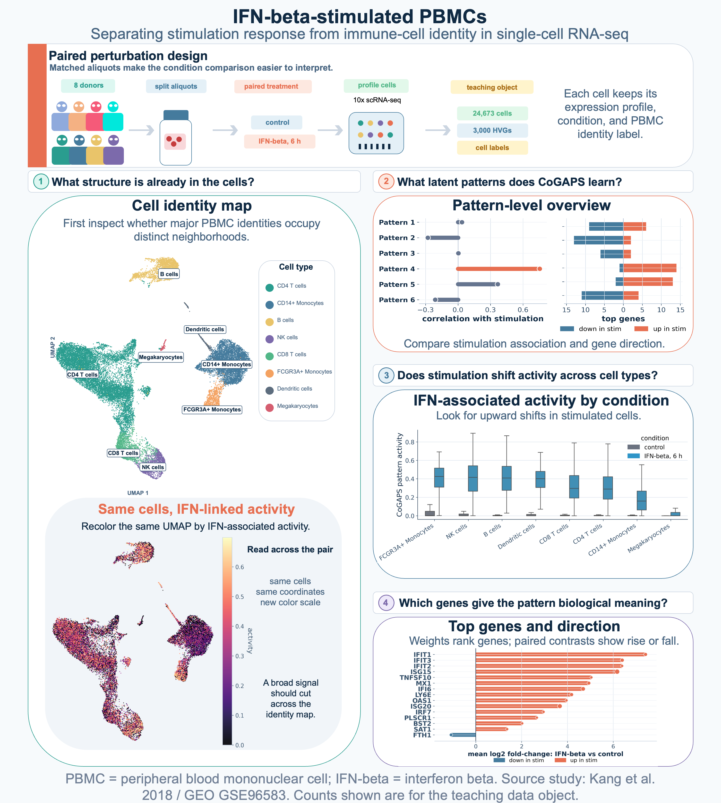

#### {.outline }

{fig-alt="Roadmap figure showing how the case study turns PBMC data into CoGAPS evidence, from biological setting through model resolution, activity patterns, identity comparison, and response evidence." width=900 .lightbox}

####
