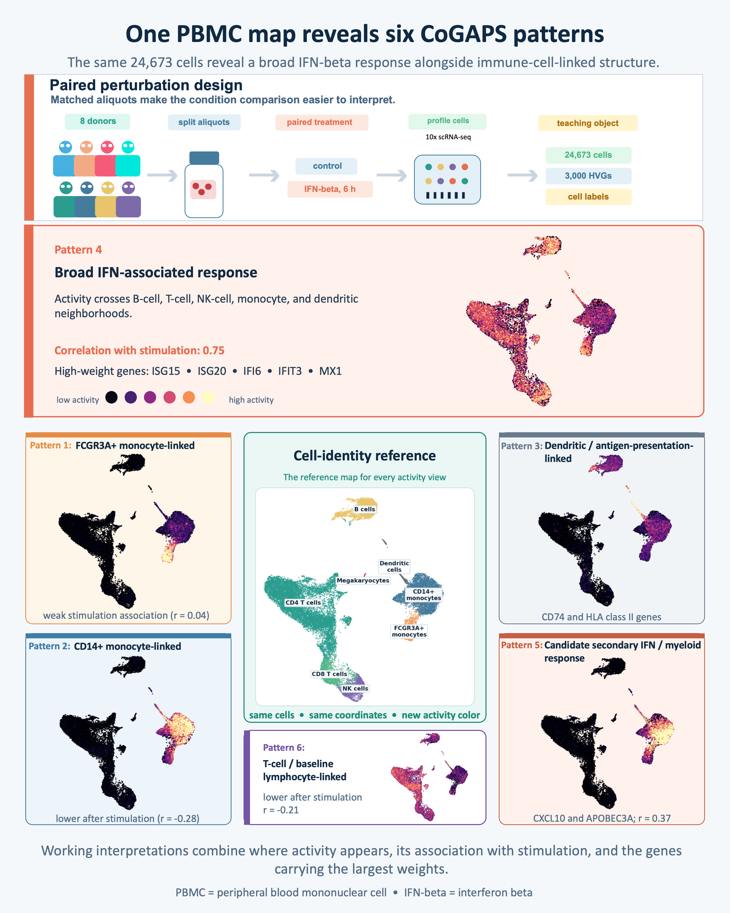

{fig-alt="Opening figure summarizing the paired IFN-beta PBMC experiment and the selected R CoGAPS pattern atlas. Eight donors contribute matched control and six-hour IFN-beta aliquots, producing a prepared dataset of 24,673 cells and 3,000 highly variable genes. A central cell-identity UMAP is surrounded by six activity maps; Pattern 4 is highlighted as a broad IFN-associated response, while the other patterns show monocyte-, dendritic-, myeloid-, and lymphocyte-linked structure." width=900 .lightbox}
