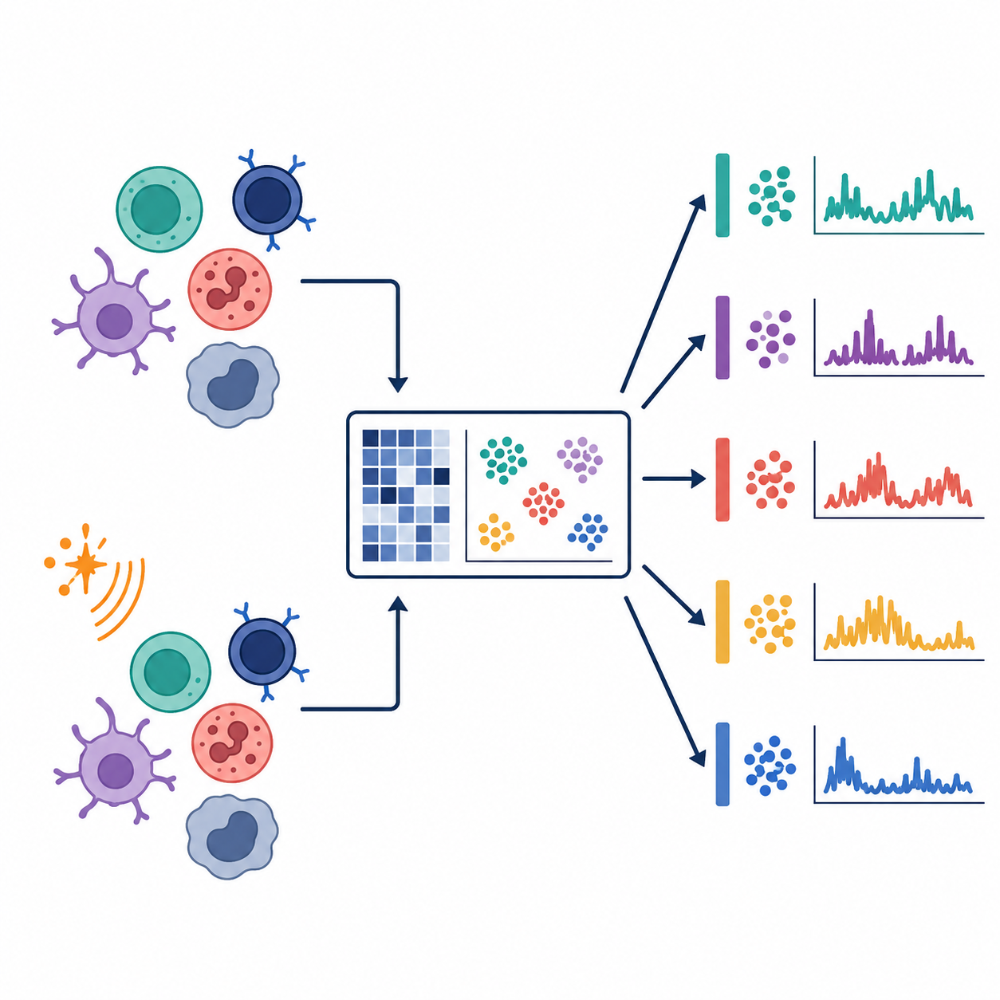
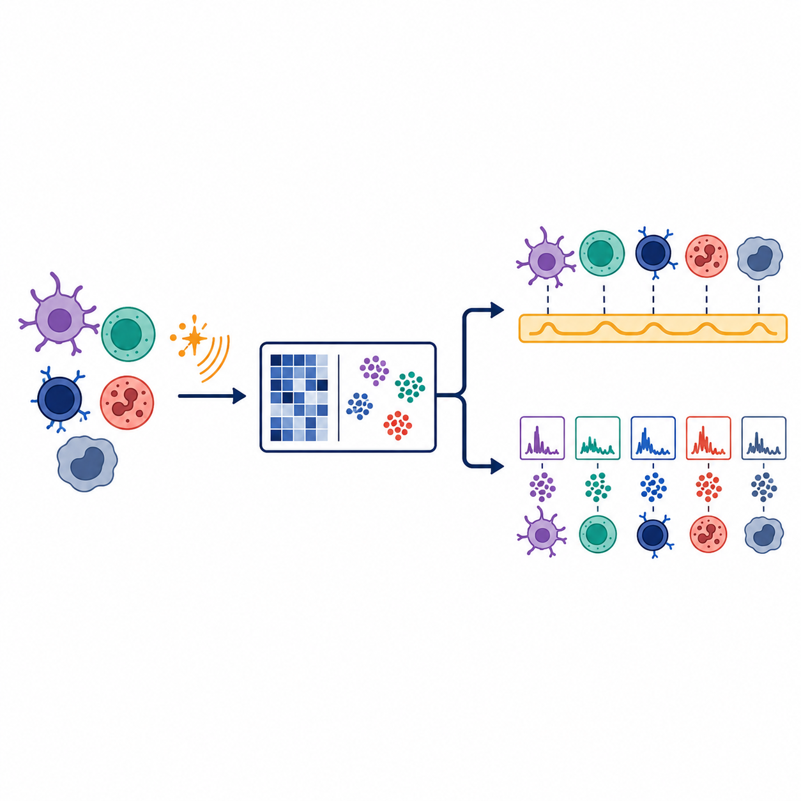
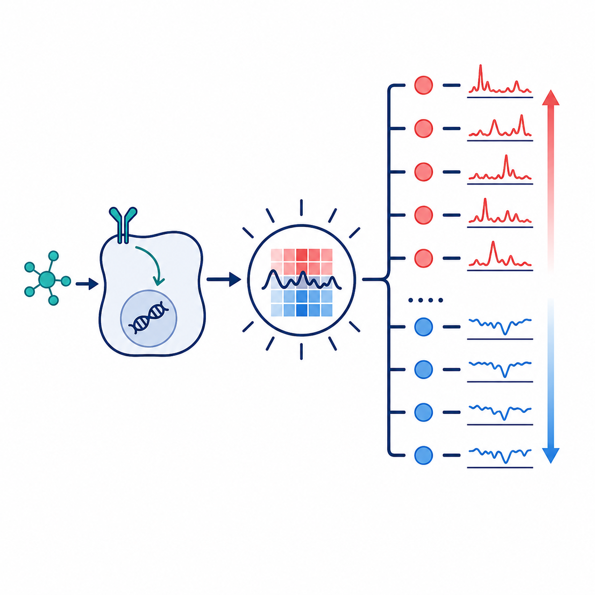
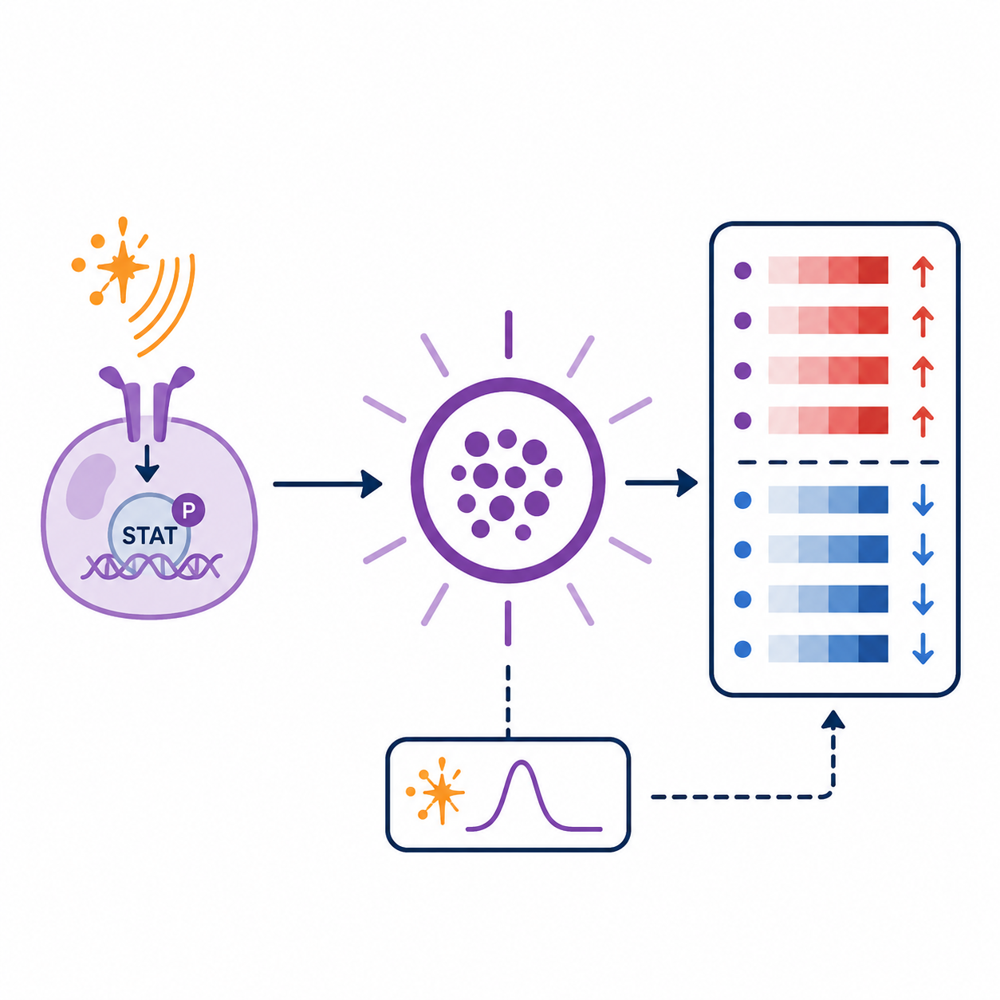

# **Main Questions**
***

The Motivation section introduced the central puzzle: each  carries , donor context, and  response information at the same time. The questions below turn that puzzle into an analysis path. You will first inspect what  learns from control and IFN-beta-stimulated cells, then ask whether the learned  separate broad  from , which genes support the , and how that pattern varies across annotated PBMC cell types.

:::{.main_question}
::::{.main_question_header}
Our main questions
::::
::::{.inner_block}
1. What  are present in IFN-beta stimulated and control PBMC  data?
1. Can CoGAPS help distinguish broad  from ?
1. Which genes define the strongest , and what is their  in stimulation?
1. How does the IFN-associated pattern vary across annotated PBMC cell types?
::::
:::

::: {.aside}
**Draft note:** Revisit the "Where it is answered" and "Expected takeaway" columns after Data Exploration, Data Visualization, and Data Analysis are fully drafted.
:::

<table style="min-width: 900px; border-collapse: separate; border-spacing: 0 0.85rem;">
<colgroup>
<col style="width: 150px;">
<col style="width: 29%;">
<col style="width: 32%;">
<col style="width: 27%;">
</colgroup>
<thead>
<tr style="vertical-align: top;">
<th></th>
<th>Research question</th>
<th>Where it is answered</th>
<th>What you should learn</th>
</tr>
</thead>
<tbody>
<tr style="vertical-align: top;">
<td></td>
<td><strong>Question 1</strong> What latent transcriptional programs are present in IFN-beta stimulated and control PBMC single-cell RNA-seq data?</td>
<td><strong>Data Import</strong> introduces the teaching PBMC dataset and the saved CoGAPS results used for the main analysis. <strong>Data Exploration</strong>, <strong>Data Visualization</strong>, and <strong>Data Analysis</strong> then inspect the learned gene weights, cell activities, and pattern summaries.</td>
<td>CoGAPS represents the PBMC data as multiple latent transcriptional patterns rather than one label per cell. Those patterns become the signals you will interpret in later sections.</td>
</tr>
<tr style="vertical-align: top;">
<td></td>
<td><strong>Question 2</strong> Can CoGAPS help distinguish broad stimulation-associated activity from cell-type-linked immune programs?</td>
<td><strong>Data Exploration</strong> and <strong>Data Visualization</strong> show how cells are grouped by condition and cell type. <strong>Data Analysis</strong> compares how strongly each pattern follows stimulation, which genes define it, and where its activity is strongest across labeled cell types.</td>
<td>A useful model should help separate a broad stimulation-associated activity signal from patterns that look more cell-type-linked or mixed.</td>
</tr>
<tr style="vertical-align: top;">
<td></td>
<td><strong>Question 3</strong> Which genes define the strongest IFN-associated pattern, and what is their direction in stimulation?</td>
<td><strong>Data Visualization</strong> previews how top pattern genes can be paired with expression direction. <strong>Data Analysis</strong> identifies the IFN-associated pattern from cell activities, ranks its top genes, and checks whether those genes are higher or lower in IFN-beta-stimulated cells.</td>
<td>The IFN-associated interpretation should be supported by canonical , and  must be interpreted alongside directionality.</td>
</tr>
<tr style="vertical-align: top;">
<td></td>
<td><strong>Question 4</strong> How does the IFN-associated pattern vary across annotated PBMC cell types?</td>
<td><strong>Data Visualization</strong> previews IFN-associated activity by cell type and condition. <strong>Data Analysis</strong> compares the pattern across labeled PBMC cell types and checks whether the same gene-direction story appears within those groups.</td>
<td>The IFN-associated pattern should be read as broad but not uniform: its cell activity can cut across immune-cell identities while still varying in strength across cell types.</td>
</tr>
</tbody>
</table>

The questions are ordered intentionally. First you inspect the latent patterns that CoGAPS learns. Then you separate shared stimulation structure from cell-type-linked structure. Only after that do you attach biological meaning through top genes, directionality, and cell-type summaries.

***
