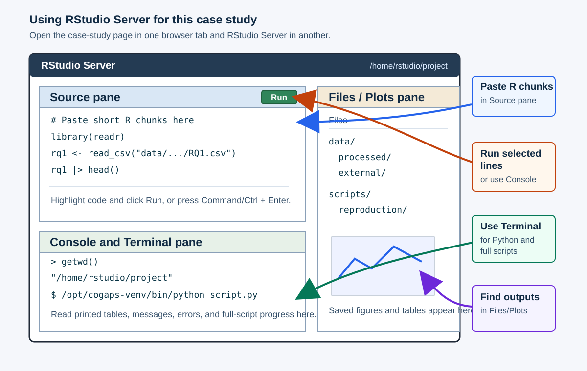

# **Packages and Setup**
***

This section gets your computer ready for the case study. The main learner path uses the case-study repository, the validated Docker image, included teaching data, saved model-selection summaries, and lightweight exports from the selected CoGAPS model. That path lets you focus on importing, checking, visualizing, and interpreting evidence without waiting for long model runs.

The full local reproduction path is optional. It uses the same repository and Docker image, but adds larger files so a reviewer, instructor, or advanced learner can regenerate selected-model outputs. The high-performance-computing sweep is not rerun in the main learner path; later sections inspect the included sweep summaries instead.

This case study uses R as the primary implementation and Python as a parallel implementation in the second tab. The R path uses `SingleCellExperiment` and Bioconductor `CoGAPS`; the Python path uses `AnnData` and PyCoGAPS-compatible saved outputs. The scientific workflow is the same in both languages, but saved CoGAPS outputs are kept separate because the two implementations should be treated as parallel analyses rather than numerically identical reruns.

## What the setup provides

Think of setup as four connected pieces:

| Setup piece | What it provides | When you need it |
|---|---|---|
| Docker image | R, Python, CoGAPS, PyCoGAPS, Quarto, plotting tools, and the OpenMP-enabled runtime used for this case study. | Use this for the main learner path and for full local reproduction. |
| GitHub repository | The case-study pages, scripts, manifests, included teaching data, selected-model summaries, and figures. | Use this for the main learner path. |
| Optional large-file archive | Larger source or model files, such as full model objects or dense CoGAPS inputs, that are not kept in ordinary GitHub history. | Use this only for full local reproduction or deeper audit work. |
| HPC sweep provenance | Included sweep summaries and scripts documenting the broader rank search. | Inspect the summaries in the lesson; rerunning the sweep is separate cluster work. |

The first figure keeps those pieces separate. Docker supplies the software environment. GitHub supplies the files used in the main lesson. Optional Zenodo or local files support deeper rebuilding, and the HPC sweep remains a separate provenance layer.

{#fig-packages-setup-resources-cs4 width="100%" .lightbox}

The second figure shows how the main learner path differs from full local reproduction. Follow the left path for the case study itself. Use the upper-right path only if you want to rebuild selected files after obtaining the larger inputs. Treat the lower-right HPC sweep as provenance: the case study includes the sweep summaries so you can evaluate rank evidence without launching cluster jobs.

{#fig-packages-setup-workflow-cs4 width="100%" .lightbox}

## Main learner setup

Start here to run the main learner path. If you only want to read the rendered case study, you can skip software setup.

### Check that Docker is ready

Open Docker Desktop and wait for its engine to start. Use the **Host Terminal**, meaning a terminal on your computer outside RStudio and the case-study container. The commands below use Bash-style syntax: use Terminal on macOS or Linux, or a WSL terminal with [Docker Desktop integration enabled](https://docs.docker.com/desktop/features/wsl/){target="_blank"} on Windows, rather than PowerShell or Command Prompt.

**Host Terminal**

```bash
docker info
```

Look for a `Server` section containing a server version and system information, without a connection error. A `Client` section alone does not confirm that the engine is reachable. If you see a message such as "Cannot connect to the Docker daemon", the terminal cannot reach the engine. Check that Docker Desktop is open and has finished starting, then try again. If the error persists, check Docker's connection settings; do not move the command into the RStudio Console. If `docker` is not found, check the Docker installation before continuing.

### Download the project

Choose **one** of the following routes. Both use the repository's `main` branch. A ZIP download provides the project files without requiring Git or downloading the Git history.

**Option 1: Clone with Git**

Open the Host Terminal in the folder where you want to keep the case study, then run:

**Host Terminal**

```bash
git clone --branch main https://github.com/opencasestudies/ocs-bio-latent-variable.git
cd ocs-bio-latent-variable
```

**Option 2: Download ZIP without Git**

1. Open the [case-study repository](https://github.com/opencasestudies/ocs-bio-latent-variable){target="_blank"}, select the `main` branch, and choose **Code > Download ZIP**.
2. Extract the ZIP and open the extracted folder. Find the folder containing `index.qmd`, `scripts/`, and `data/`; this is the project root. Use those contents to identify it, rather than relying on the extracted folder's name.
3. In the Host Terminal, change to that project root. Replace the example path below with the full path to your extracted folder, keeping the quotes if the path contains spaces.

**Host Terminal**

```bash
cd "/full/path/to/extracted/project"
```

### Check the project root

After either download route, check your location and confirm that all three entries are present:

**Host Terminal**

```bash
pwd
ls -d index.qmd scripts data
```

Continue only when `index.qmd`, `scripts`, and `data` are all listed without a missing-file error. If an entry is missing, change to the project root and repeat the check. The Docker command below mounts your current folder, so starting from the ZIP's parent folder would give RStudio the wrong files.

### Launch the case-study environment

From the checked project root, pull and launch the existing case-study image:

**Host Terminal**

```bash
docker pull --platform linux/amd64 othomas2/pycogaps-runtime-guide:0.3.1

docker run --platform linux/amd64 --rm -it \
  -p 127.0.0.1:8787:8787 \
  -e PASSWORD="Password12" \
  -v "$PWD":/home/rstudio/project:rw \
  othomas2/pycogaps-runtime-guide:0.3.1
```

This command starts RStudio Server inside the container and mounts your downloaded project at `/home/rstudio/project`. The mount is writable (`rw`), so small outputs you create in the project folder are saved back to your local project folder, whether you cloned it or extracted a ZIP.

The `127.0.0.1` port mapping makes RStudio available only from your own computer. Keep that address in the command when using the example password below.

The `--platform linux/amd64` option keeps the runtime consistent with the validated case-study image. On Apple silicon Macs, Docker may use emulation for this image, so long model-fitting runs can be slower than they would be on native Linux hardware. The main learner path avoids that problem by using included CoGAPS evidence.

## Full local reproduction setup

<details>
<summary><strong>Optional: inspect or rebuild full model outputs</strong></summary>

Use this path only if you want to regenerate selected-model files or inspect larger model objects. Keep the GitHub project and obtain any additional inputs from [Zenodo record 21208760](https://zenodo.org/records/21208760){target="_blank"}, DOI [10.5281/zenodo.21208760](https://doi.org/10.5281/zenodo.21208760){target="_blank"}. This fixed release contains the source and saved-model files used by this guide. The main learner path does not need these additional downloads.

Follow [Download The Files For Your Route](#download-the-files-for-your-route) to choose files from the record's **Files** list. Download only the inputs your chosen stage needs: preprocessing needs the larger source file, while inspecting or exporting the saved R model needs its `.rds` file. Fitting a new R model from the included prepared data does not require an archive download or a pre-existing model.

The guide's file-placement table and `data/external/README.md` give the exact destinations, including the required filename change for the optional Python model. The record provides individual files, so keep their downloaded names in a separate reference folder and copy only needed inputs into a separate reproduction working project.

Creating an archive folder does not download these files. Keep the downloaded reference copies unchanged and mount that folder read-only, as shown in the guide. Use its [stage-specific file check](#stage-1-confirm-the-environment-and-files) to verify inputs before running a script. It reports missing files and checks original archive inputs against their recorded sizes and checksums.

Full local reproduction uses complete scripts rather than copying every chunk by hand. Follow the [Full Reproduction Guide](#full-reproduction-guide) to check the inputs for your chosen stage before running a script. Reading the main case study does not require any model reruns.

The selected-model launchers below start their own Docker containers. Run them in the **Host Terminal**, not the RStudio Terminal inside the container or the RStudio Console. Keep Docker Desktop running. If your first Host Terminal is occupied by the RStudio Server container, open a second Host Terminal window or tab.

Change to the same local project root you mounted for RStudio, whether you cloned it or extracted a ZIP. Replace the example path with the path on your computer; `/home/rstudio/project` is the path inside the RStudio container, not the host path.

**Host Terminal**

```bash
cd "/full/path/to/your/project"
pwd
ls -d index.qmd scripts data
```

The following commands fit models and write outputs; they are not setup checks. Choose the R route for primary reproduction. The parallel Python route is optional and requires the separate dense CoGAPS input file. You do not need to run both.

**Host Terminal: R selected-model launcher**

```bash
bash scripts/reproduction/run_selected_model_r.sh
```

**Host Terminal: optional Python selected-model launcher**

```bash
bash scripts/reproduction/run_selected_model_python.sh
```

Keep any model-fitting run visible in the Host Terminal so you can watch its progress. The launchers stop if a full model already exists; see the guide before intentionally replacing a saved result. After fitting, return to the **RStudio Terminal inside the container** for the guide's export commands and run `cd /home/rstudio/project` there first. These export commands use the R and Python packages installed in the container.

The full rank sweep is intentionally not part of local reproduction. Learners analyze the included sweep summaries under `data/processed/k_selection/`.

</details>

## Open RStudio Server

After Docker starts, open [http://localhost:8787](http://localhost:8787){target="_blank"} and sign in with username `rstudio` and password `Password12`. Keep the online case-study page open in one browser tab and RStudio Server open in another.

In RStudio Server, work from `/home/rstudio/project`, the mounted project folder. Set the working directory in each session you use before running code with relative file paths.

**RStudio Console**

```r
setwd("/home/rstudio/project")
getwd()
```

**RStudio Terminal inside the container**

Open the Terminal tab in RStudio, then run:

```bash
cd /home/rstudio/project
pwd
```

Each check should report `/home/rstudio/project`. The RStudio Console and the RStudio Terminal inside the container have separate working directories: changing one does not change the other. Use `getwd()` to check R's location and `pwd` to check the Terminal's location.

The schematic below labels the main panes you will use while working through the case study.

{#fig-rstudio-server-labeled-cs4 width="100%"}

| What you are running | Where to paste or run it | Where output appears |
|---|---|---|
| Short R chunks from an R tab | A saved R script in the Source pane, run in the RStudio Console | Console output, Plots pane, and saved files in the Files pane |
| Short Python chunks from a Python tab | Python session started from the RStudio Terminal inside the container, or a saved `.py` script run there | Plain-text tables in the Terminal; plot PNGs under `learner_outputs/python/` in the Files pane |
| Selected-model launchers (`run_selected_model_r.sh` or `run_selected_model_python.sh`) | Host Terminal at your local project root | Model progress messages and files in the selected-model output folder |
| Reproduction export commands (`Rscript` or `/opt/cogaps-venv/bin/python`) | RStudio Terminal inside the container, from `/home/rstudio/project` | Export messages and regenerated tables or figures |

**R: keep your work in a saved script**

Choose **File > New File > R Script** and save the new file as `case_study_work.R` in `/home/rstudio/project`. Add successive R chunks to this script as you work through the case study. Highlight the lines you want to run and click **Run**; they execute in the RStudio Console. Use the Console directly for brief checks such as `getwd()`, rather than keeping your only copy of the workflow in the Console history.

Keep `setwd("/home/rstudio/project")` and the package and helper setup chunks near the top of your script. When you return to a new R session, reopen the script and rerun those setup chunks and any earlier chunks that create objects needed by the section you are resuming. Saving the script preserves your code, not the objects in an R session. Files saved in the mounted project folder remain in your local project when the container stops.

**Python: start a separate session**

[]{#python-terminal-output}

For Python chunks, start the existing Python workflow from the Terminal pane, not the RStudio Console.

**RStudio Terminal inside the container**

```bash
cd /home/rstudio/project
/opt/cogaps-venv/bin/python
```

**Python session**

Once the `>>>` prompt appears, paste Python code only; do not include the prompt itself. For longer Python examples, save the code in a `.py` file in `/home/rstudio/project` and run it with `/opt/cogaps-venv/bin/python` from the RStudio Terminal inside the container. Run `exit()` in the Python session to return to the Terminal before entering shell commands such as `cd`.

Run the Python package and helper setup chunks below before the later examples. The table helper prints plain-text tables in the Terminal. Wide tables may continue in blocks of columns; their values are not shortened. You can compare your output with the tables shown on this page.

Python plots do not appear in RStudio's R Plots pane. The plotting chunks use `show_plot()` to save each plot as a PNG under `learner_outputs/python/` and print its full path. This folder is created when you run your first plot. In RStudio's **Files** pane, open **Home > project > learner_outputs > python** and click the PNG filename to view it in the browser. Refresh the Files pane if the new file is not listed. The same PNG is also saved in the `learner_outputs/python/` folder of your local project on your computer.

Each plotting chunk supplies a descriptive filename. Rerunning that chunk replaces its PNG, so rename an earlier copy first if you want to keep it. These PNGs are your own copies; saving them does not replace the case study's included data or figures.

## Load packages

The Docker image already installs the packages used below. Load the packages for the language you plan to use.

::: {.panel-tabset}

### R

```{r}
#| label: setup-r-packages
#| message: false
suppressPackageStartupMessages({
  library(zellkonverter)
  library(SingleCellExperiment)
  library(SummarizedExperiment)
  library(CoGAPS)
  library(jsonlite)
  library(ggplot2)
  library(dplyr)
  library(tibble)
  library(readr)
  library(nlme)
})
```

Package | Use
------- | ---
`zellkonverter` | Read `.h5ad` files into `SingleCellExperiment`
`SingleCellExperiment` | Represent single-cell data in Bioconductor form
`SummarizedExperiment` | Access assays and metadata cleanly
`CoGAPS` | Optional local CoGAPS model execution in R
`jsonlite` | Read saved metrics JSON files
`ggplot2` | Plot figures in the R workflow
`dplyr`, `tibble`, `readr` | Summaries and lightweight artifact I/O
`nlme` | Optional donor-aware mixed-model check

### Python

```{python}
#| label: setup-python-packages
from __future__ import annotations

from pathlib import Path
import json
import platform
import sys

import anndata as ad
import matplotlib.pyplot as plt
import numpy as np
import pandas as pd
from scipy import sparse
import statsmodels.formula.api as smf

from scripts.helpers.case_study_display import render_table, show_plot
```

Package | Use
------- | ---
[`anndata`](https://anndata.readthedocs.io/){target="_blank"} | Read and write AnnData `.h5ad` files
[`pandas`](https://pandas.pydata.org/){target="_blank"} | Summarize metadata, pattern tables, and directionality outputs
[`numpy`](https://numpy.org/){target="_blank"} | Matrix and numerical operations
[`scipy`](https://scipy.org/){target="_blank"} | Sparse matrix handling and statistical summaries
[`statsmodels`](https://www.statsmodels.org/){target="_blank"} | Optional donor-aware mixed-model check
[`matplotlib`](https://matplotlib.org/){target="_blank"} | Plot figures used in the case study
[`PyCoGAPS`](https://github.com/FertigLab/pycogaps){target="_blank"} | Optional local CoGAPS model execution in Python

:::

The R and Python tabs are alternate ways to complete the same conceptual checks. Choose one language for the main lesson unless you specifically want to compare implementations.

## Check the runtime

These checks confirm that the main packages are available in the language you choose.

::: {.panel-tabset}

### R

```{r}
#| label: runtime-check-r
#| message: false
#| warning: false
r_runtime_packages <- c(
  "zellkonverter",
  "SingleCellExperiment",
  "SummarizedExperiment",
  "CoGAPS",
  "jsonlite",
  "ggplot2",
  "dplyr",
  "tibble",
  "readr",
  "nlme"
)

data.frame(
  item = c("R", r_runtime_packages),
  available = c(TRUE, vapply(r_runtime_packages, requireNamespace, logical(1), quietly = TRUE)),
  version = c(
    R.version.string,
    vapply(
      r_runtime_packages,
      function(pkg) {
        if (requireNamespace(pkg, quietly = TRUE)) {
          as.character(utils::packageVersion(pkg))
        } else {
          "not installed"
        }
      },
      character(1)
    )
  )
)
```

### Python

```{python}
#| label: runtime-check-python
#| results: asis
import importlib.util
import scipy
import statsmodels

python_runtime_packages = ["anndata", "matplotlib", "numpy", "pandas", "scipy", "statsmodels"]

python_runtime_check = pd.DataFrame(
    {
        "item": ["Python", *python_runtime_packages, "PyCoGAPS"],
        "available": [
            True,
            *[importlib.util.find_spec(pkg) is not None for pkg in python_runtime_packages],
            importlib.util.find_spec("PyCoGAPS") is not None,
        ],
        "version": [
            sys.version.split()[0],
            ad.__version__,
            plt.matplotlib.__version__,
            np.__version__,
            pd.__version__,
            scipy.__version__,
            statsmodels.__version__,
            "installed" if importlib.util.find_spec("PyCoGAPS") is not None else "optional/not installed",
        ],
    }
)
print(render_table(python_runtime_check))
```

:::

## Where the case-study files live

The case study uses the same few folders repeatedly. You do not need to memorize every file path, but you do need to run the short setup code below before continuing. That code teaches R or Python where to find the prepared data, model-selection summaries, saved CoGAPS outputs, and optional reproduction files.

| Location | What you will use it for |
|---|---|
| `data/processed/input/` | Prepared single-cell data used in the main lesson |
| `data/processed/k_selection/` | Saved model-resolution summaries from the rank sweep |
| `data/processed/selected_model_k6/r/` | Included compact R CoGAPS tables, matrix exports, and model metadata |
| `data/processed/selected_model_k6/python/` | Included compact Python CoGAPS tables, matrix exports, and model metadata |
| `img/` | Figures shown in the case study |
| `scripts/` | Helper scripts and optional reproduction scripts |
| `learner_outputs/python/` | Your PNGs from Python plotting chunks; created on the first plot, not an included data folder |

Both selected-model folders include `pattern_summary.csv` and other compact teaching outputs. The full saved model objects, `cogaps_K6_seed2_iter2000.rds` in the R folder and `cogaps_K6_seed2_iter2000.h5ad` in the Python folder, are optional files for separate download. They are not included in a standard clone or ZIP and are not required for the main learner path.

Do not confuse the optional Python model file with `data/processed/input/preprocessed_cells_hvg3000.h5ad`: that file is the prepared dataset included for the main learner path. You can find the two selected-model folders in RStudio's Files pane by opening `data`, then `processed`, then `selected_model_k6`, and choosing `r` or `python`.

Run the helper setup once after loading packages. If you are working through the case study interactively, run the tab for your language before moving to the Data Import section. Later chunks depend on these helper paths.

::: {.panel-tabset}

### R

```{r}
#| label: setup-paths-r
source(file.path("scripts", "helpers", "case_study_paths.R"))
```

### Python

```{python}
#| label: setup-paths-python
from scripts.helpers.case_study_paths import *
```

:::

Now check that the mounted project folder contains the included files used at the start of the case study.

::: {.panel-tabset}

### R

```{r}
#| label: runtime-check-files-r
data.frame(
  item = c(
    "case-study manifest",
    "processed teaching input",
    "model-resolution summaries",
    "selected R CoGAPS evidence",
    "selected Python CoGAPS evidence"
  ),
  available = c(
    file.exists(ARTIFACT_MANIFEST_JSON_R),
    file.exists(PREPROCESSED_H5AD_R),
    dir.exists(MODEL_SELECTION_DIR_R),
    dir.exists(SELECTED_R_RESULTS_DIR_R),
    dir.exists(SELECTED_PYTHON_RESULTS_DIR_R)
  )
)
```

### Python

```{python}
#| label: runtime-check-files-python
#| results: asis
python_file_check = pd.DataFrame(
    {
        "item": [
            "case-study manifest",
            "processed teaching input",
            "model-resolution summaries",
            "selected R CoGAPS evidence",
            "selected Python CoGAPS evidence",
        ],
        "available": [
            ARTIFACT_MANIFEST_JSON.exists(),
            PREPROCESSED_H5AD.exists(),
            MODEL_SELECTION_DIR.is_dir(),
            SELECTED_R_RESULTS_DIR.is_dir(),
            SELECTED_PYTHON_RESULTS_DIR.is_dir(),
        ],
    }
)
print(render_table(python_file_check))
```

:::

***
