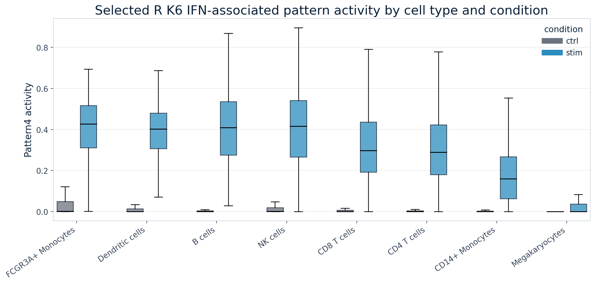

# **Summary**
***

## **Synopsis**
***

In this case study, we used a processed PBMC single-cell RNA-seq dataset with control and IFN-beta stimulated cells to learn how a latent-variable method can reveal transcriptional programs that cut across cell-type labels.

We inspected the processed single-cell object, summarized condition and cell-type metadata, prepared a genes x cells CoGAPS input, and loaded selected R-primary CoGAPS artifacts. The rank `K = 6` was selected before the main learner workflow using a limited model-selection sweep and follow-up pattern-structure comparison. Learners do not need to run that sweep to complete the case study.

The strongest stimulation-associated program in the selected R K6 model is the IFN-associated pattern, labeled `Pattern4` in that run. It is anchored by canonical interferon-stimulated genes, including `ISG15`, `ISG20`, `IFI6`, `IFIT3`, `IFIT1`, `MX1`, `IFIT2`, `IRF7`, `OAS1`, `PLSCR1`, and `BST2`.

We also performed a targeted directionality check because CoGAPS pattern weights do not by themselves indicate whether genes are up or down in stimulation. In the selected R K6 analysis, 14 of the top 15 IFN-associated pattern genes were up in IFN-beta stimulation, while `FTH1` was down.

The IFN-associated pattern activity appears broad across PBMC cell types, supporting an activity-like IFN-response interpretation. Other patterns have interpretable gene anchors, such as myeloid and antigen-presentation genes, but those secondary interpretations should remain more cautious.

## **Summary Plot**
***

{fig-alt="Boxplots of selected R K6 IFN-associated CoGAPS pattern activity across PBMC cell types, split by control and IFN-beta stimulated conditions." width=800 .lightbox}

***
